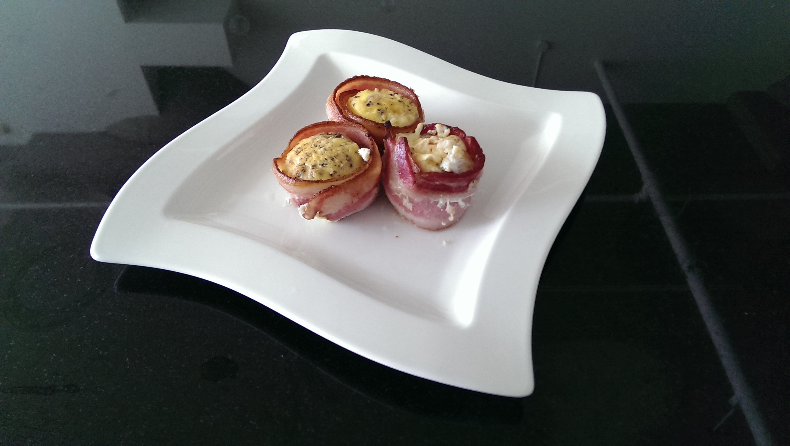

Bacon and eggs is a classic breakfast choice.  This post describes as new take on this classic, as shown below.

__Equipment__
You will need the following equipment for this recipe.

1. A muffin tray
2. A measuring cup or bowl

__Ingredients__
You will also need the following ingredients.

1. Bacon
2. Eggs
3. _Milk (optional)_
4. _Salt and Pepper (optional)_

__Recipe__

1. 